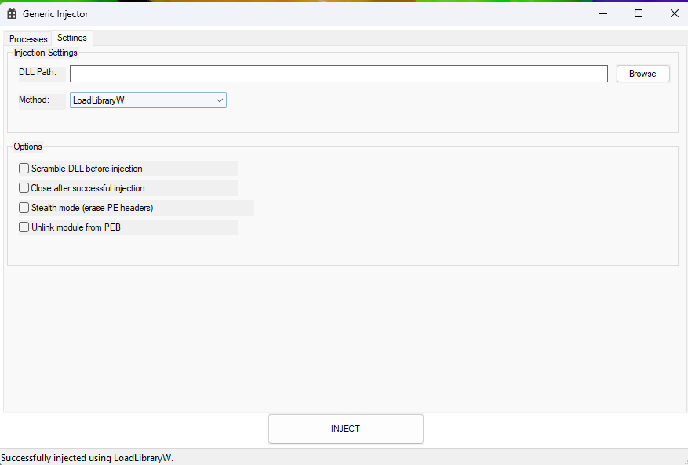
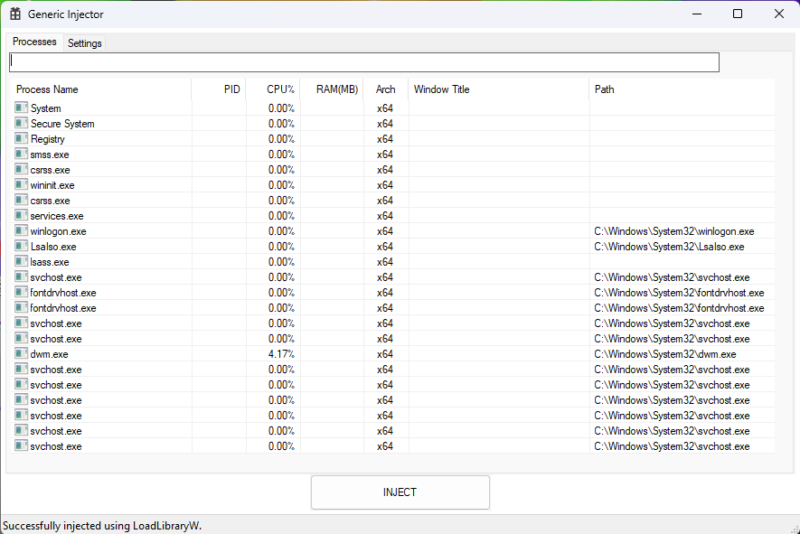

# Generic Injector

## Features
- **Process List**: View running processes with icons, CPU, memory, architecture, and window titles.
- **Multiple Injection Methods**:
  - `LoadLibraryW`: Classic remote thread injection.
  - `Manual Map`: Stealthy mapping without using the OS loader.
  - `NtCreateThreadEx`: Stealthier alternative to `CreateRemoteThread`.
  - `Thread Hijack`: Injects by hijacking an existing thread context.
- **DLL Scrambling**: Randomizes PE section names and wipes timestamps before injection.
- **Stealth Options**: Options to erase PE headers from the target process after manual mapping.

## Build Requirements
- Visual Studio 2022
- Windows SDK 10+
- C++17

## Disclaimer
This project is for educational purposes only. Do not use this software for malicious purposes.

## Images 
 

