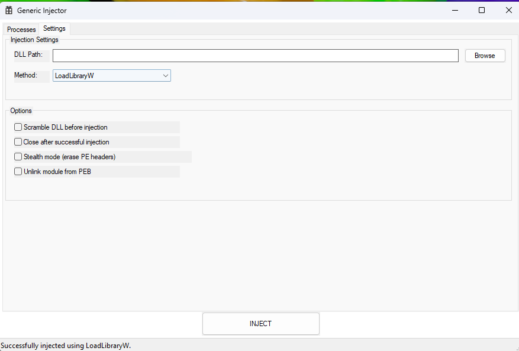
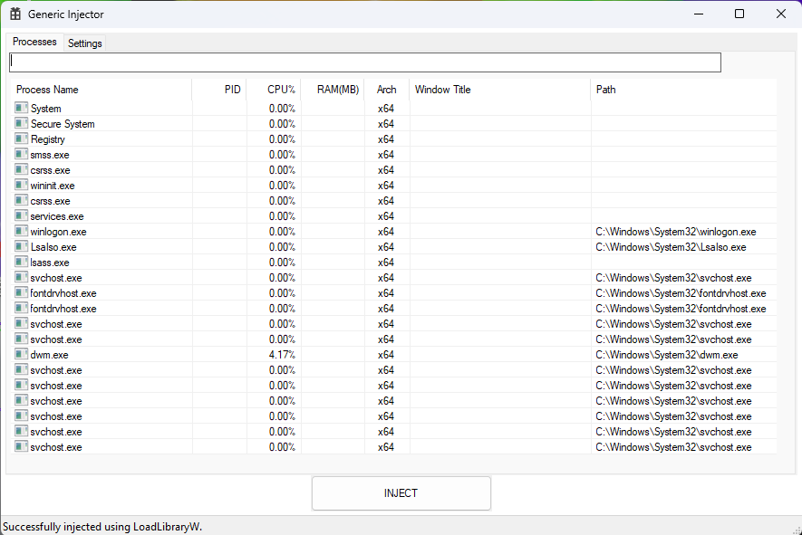

# Generic Injector

## Features
- **Process List**: View running processes with icons, CPU, memory, architecture, and window titles.
- **Multiple Injection Methods**:
  - `LoadLibraryW`: Classic remote thread injection.
  - `Manual Map`: Stealthy mapping without using the OS loader.
  - `NtCreateThreadEx`: Stealthier alternative to `CreateRemoteThread`.
  - `Thread Hijack`: Injects by hijacking an existing thread context (64-bit only).
- **DLL Scrambling**: Randomizes PE section names and wipes timestamps before injection.
- **Stealth Options**: Options to erase PE headers from the target process after manual mapping.

## Layout

```
generic injector/
├── include/            headers, nothing else
│   ├── api.h             public declarations
│   ├── types.h           data structures
│   ├── globals.h         all global state (namespace gi)
│   ├── framework.h       windows/CRT includes + linked libs
│   ├── targetver.h       sdk version selection
│   └── resource_ids.h    control / resource ids
├── src/
│   ├── app/main.cpp        wWinMain, window procedure, layout
│   ├── core/               injection, process enumeration, pe scrambling
│   └── ui/settings_panel.cpp
├── resource/
│   ├── generic_injector.rc
│   └── generic_injector.manifest
└── assets/                 icons
```

All globals live in `include/globals.h` under the `gi` namespace as C++17
`inline` variables, so there is no separate globals `.cpp` to keep in sync.
All project-owned identifiers (types, functions, variables, members) are
snake_case; Windows SDK types keep their original casing.

## Build Requirements
- Visual Studio 2022
- Windows SDK 10+
- C++17

Builds clean on `Debug`/`Release` x `x86`/`x64`.

## Disclaimer
This project is for educational purposes only. Do not use this software for malicious purposes.

## Images 
 

